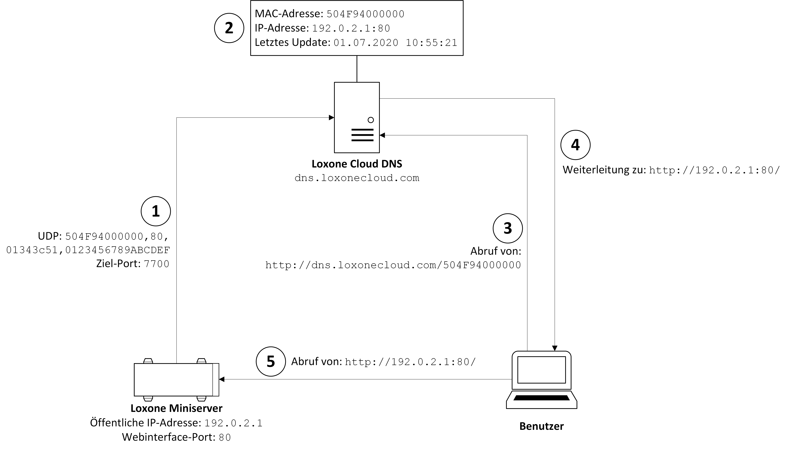

Um den Loxone Miniserver aus dem Internet erreichbar zu machen, wird der Cloud DNS Dienst von Loxone angeboten. Die Bekanntgabe der öffentlich erreichbaren IP-Adresse des Heimnetzwerks erfolgt dabei nicht authentifiziert. Dadurch ist es einem Angreifer bei Kenntnis der MAC-Adresse eines Loxone Miniservers möglich, seine IP-Adresse bei dem Dienst zu hinterlegen. Stellt ein Angreifer an dieser IP-Adresse einen Webserver bereit (beispielsweise mit einer Website ähnlich dem Loxone Webinterface), kann er die Login-Daten eines Benutzers abgreifen und so Zugang zum Loxone Miniserver und in­fol­ge­des­sen zum gesamten Loxone Smart Home entsprechend der Berechtigungen des Benutzers erlangen.

| **Titel** | Loxone Miniserver - Schwachstelle im Loxone Cloud DNS |
| :-------- | :---------------------------------------------------- |
| **Produkt** | Loxone Miniserver Gen. 1 |
| **Verwundbare Firmwareversionen** | Alle vor `11.1.9.3` seit dem es Loxone Cloud DNS gibt (bestätigt von Loxone; getestet mit `11.0.5.5` und `10.3.11.27`) |
| **Gepatchte Firmwareversion** | `11.1.9.3` |
| **CVE-Nummer** | Beantragt |
| **Hersteller Website** | [https://www.loxone.com/dede/](https://www.loxone.com/dede/) |
| **Gefunden im** | Juni 2020 |
| **Gefunden von** | IoT-Lab, Fachhochschule Oberösterreich, Campus Hagenberg |
| **Website** | [https://www.fh-ooe.at/si/](https://www.fh-ooe.at/si/) |
| **Team** | Simon Birngruber BSc (FH OÖ Campus Hagenberg) |
|| Dieter Vymazal BSc MSc (FH OÖ Campus Hagenberg) |
|| DI Markus Zeilinger (FH OÖ Campus Hagenberg) |
| **Kontakt Informationen** | Simon Birngruber  simon.birngruber@students.fh-hagenberg.at  PGP Fingerprint: E013 87A8 D4CA EB69 78E6  014C A27E 5026 6149 054A |

## Herstellerbeschreibung

*„Loxone ermöglicht die einfache Steuerung und intelligente Automatisierung von Projekten aller Art. Von Smart Homes über Gewerbeobjekte bis hin zu Spezialanwendungen.“*

Quelle: [https://www.loxone.com/dede/ueber-uns/mission/](https://www.loxone.com/dede/ueber-uns/mission/)

## Übersicht

Loxone bietet als Ersatz für DDNS-Anbieter wie No-IP oder DynDNS den Dienst Loxone Cloud DNS ([https://www.loxone.com/dede/kb/cloud-dns/](https://www.loxone.com/dede/kb/cloud-dns/)) an. Damit wird Kunden, welche von ihrem Internet Service Provider für ihr Heimnetzwerk eine dynamische IP-Adresse zugeteilt bekommen, eine Möglichkeit zum Fernzugriff auf ihren Loxone Miniserver über eine fixe URI geboten. Der Zugriff erfolgt über die URI `http://dns.loxonecloud.com/{Miniserver-MAC}`, wobei es sich bei der Zeichenkette `{Miniserver-MAC}` um die Seriennummer bzw. die MAC-Adresse des Miniservers handelt. Auf Basis dieser URI findet eine Weiterleitung durch einen HTTP Redirect (`307 - Temporary Redirect`) an die zum Zeitpunkt des Zugriffs für den Loxone Miniserver hinterlegte IP-Adresse statt. Im Heimnetzwerk des Benutzers muss dafür am Router eine Portweiterleitung an den Loxone Miniserver eingerichtet sein.
Die Bekanntgabe der aktuellen, externen IP-Adresse des Heimnetzwerks übernimmt der Loxone Miniserver. Dieser sendet minütlich an eine der im Resource Record Set von `dns.loxonecloud.com` eingetragenen IP-Adressen ein UDP-Datagramm auf Ziel-Port `7700`, welches nach folgendem Schema aufgebaut ist: `504F94000000,80,01343c51,0123456789ABCDEF`
* `504F94000000` = MAC-Adresse des Miniservers
* `80` = Port, auf welchem das Webinterface des Miniservers erreichbar ist
* `01343c51` = Hexadezimale Darstellung des Build-Datums des derzeit am Loxone Miniserver installierten Webinterfaces (in diesem Beispiel `01343c51` HEX = `20200529` DEC -> 29.05.2020)
* `0123456789ABCDEF` = 8 Bytes langer hexadezimaler String, Bedeutung derzeit unbekannt, Wert hat keine erkennbaren Auswirkungen und kann (ausgenommen der fixen Länge) beliebig gewählt werden

Der Loxone Cloud DNS Dienst hinterlegt anschließend die Absender-IP-Adresse des UDP-Datagramms (= externe IP-Adresse des Heimnetzwerks) und den darin angegebenen Port als Zugangspunkt für den Loxone Miniserver mit der übermittelten MAC-Adresse.

Die grundsätzliche Funktionsweise von Loxone Cloud DNS ist in Abbildung 1 dargestellt. Der Loxone Miniserver sendet minütlich ein UDP-Datagramm mit den entsprechenden Informationen an den Loxone Cloud DNS Dienst (1). Dort werden diese Daten mit dem aktuellen Zeitstempel (im Beispiel am 01.07.2020 um 10:55:21) abgelegt (2). Ruft nun ein Benutzer die URI dieses Loxone Miniservers ab (3), erfolgt eine Weiterleitung zu der im aktuellen Eintrag hinterlegten IP-Adresse (4) (in diesem Beispiel zu `http://192.0.2.1:80/`). Abschließend wird das Webinterface direkt vom Loxone Miniserver (5) abgerufen.

 
*Abbildung 1: Funktionsweise Loxone Cloud DNS*

## Beschreibung der Schwachstelle

Bei dem zuvor beschriebenen Vorgang wird zu keinem Zeitpunkt überprüft, ob es sich bei dem Gerät, von dem das UDP-Datagramm versendet wird, tatsächlich um den Loxone Miniserver mit der angegebenen MAC-Adresse handelt. Durch diese fehlende Authentifizierung ist es einem Angreifer möglich, solche UDP-Datagramme zu versenden und dabei eine beliebige MAC-Adresse aus dem Bereich der Loxone MAC-Adressen-Herstellerkennung (OUI – Organizationally Unique Identifier) `504F94` einzutragen. Dadurch erfolgt bei Aufruf der Loxone Cloud DNS URI eine Weiterleitung zur öffentlichen IP-Adresse, von welcher das UDP-Datagramm versendet wurde. Der Angreifer kann dort beispielsweise eine Kopie des Miniserver-Webinterfaces betreiben und dadurch Benutzername und Passwort eines Benutzers abgreifen. Bereits durch das Verändern der IP-Adresse (ohne dem Bereitstellen einer Website) wird die Nichterreichbarkeit aus dem Internet (Denial of Service) erreicht, da der Loxone Miniserver über die URI nicht mehr erreichbar ist.
Ein Angriff kann auf eine beliebige MAC-Adresse im OUI-Bereich von Loxone stattfinden. Ohne der Kenntnis der MAC-Adresse kann dieser jedoch nicht zielgerichtet auf einen spezifischen Loxone Miniserver (beispielsweise an einem bestimmten Standort) ausgeführt werden.

## Proof of Concept

Für den Proof of Concept werden folgende Annahmen getroffen:
* MAC-Adresse des Loxone Miniservers: `504F94000000`
* Öffentliche IP-Adresse des Heimnetzwerks in dem sich der Loxone Miniserver befindet: `192.0.2.1`
* Öffentliche IP-Adresse des Angreifers: `192.0.2.2`
* Port auf dem das Webinterface am Loxone Miniserver erreichbar ist: `80`
* Port auf dem das Fake-Webinterface des Angreifers erreichbar ist: `8080`
* Build-Datum des installierten Webinterfaces in hexadezimaler Darstellung (29.05.2020): `01343c51`
* 8 Bytes langer hexadezimaler String: `0123456789ABCDEF`

Der im Folgenden geschilderte Ablauf ist vereinfacht in Abbildung 2 dargestellt.

 
*Abbildung 2: Ablauf Proof of Concept*

Um die Schwachstelle zu demonstrieren, wird zunächst der Loxone Miniserver bei Loxone registriert und der Loxone Cloud DNS Dienst per Loxone Config aktiviert. Anschließend beginnt der Loxone Miniserver ein UDP-Datagramm, aufgebaut wie in "Übersicht" beschrieben, zu versenden (1). Die öffentliche IP-Adresse des Loxone Miniservers (`192.0.2.1`) und der Port, über welchen das Webinterface erreichbar ist (`80`), wird dadurch beim Loxone Cloud DNS hinterlegt.
Nun kann ein Angreifer ein UDP-Datagramm mit der MAC-Adresse des entsprechenden Loxone Miniservers versenden (2). Im dargestellten Beispiel wird der Eintrag im Loxone Cloud DNS nach Versand des UDP-Datagramms vom System des Angreifers auf die IP-Adresse `192.0.2.2` und den Port `8080` aktualisiert. Findet danach ein Zugriff durch einen Benutzer statt (3) (Abruf von `http://dns.loxonecloud.com/504F94000000`), leitet der Loxone Cloud DNS Dienst auf den Webserver des Angreifers weiter (4, 5) (`http://192.0.2.2:8080/`). Auf diesem Webserver wird eine Kopie des Miniserver-Webinterfaces betrieben (Beispiel siehe Abbildung 3), wo die Login-Daten des Benutzers abgegriffen werden.

 
*Abbildung 3: Evil Webinterface*

Da der Loxone Miniserver solche UDP-Datagramme ungefähr alle 60 Sekunden versendet, wird der Eintrag des Angreifers spätestens nach dieser Zeitspanne wieder überschrieben. Mit Hilfe der in der Schnittstellenbeschreibung des Loxone Miniservers ([https://www.loxone.com/dede/kb/api/](https://www.loxone.com/dede/kb/api/)) genannten URI `http://dns.loxonecloud.com/?getip&snr={Miniserver-MAC}&json=true` erhält ein Angreifer jedoch wertvolle Informationen über den abgefragten Loxone Miniserver. Unter anderem sind dies die aktuell hinterlegte IP-Adresse sowie der Zeitstempel der letzten Aktualisierung des Eintrages. Dadurch kann die Empfangszeit des letzten UDP-Datagramms ausgelesen und das gefälschte UDP-Datagramm möglichst knapp nach diesem Zeitpunkt versendet werden. Der authentische Eintrag ist somit nur kurz aktiv und wird danach von den veränderten Daten überschrieben bis das nächste Datagramm des tatsächlichen Miniservers eintrifft. Ein Angreifer kann diesen Vorgang automatisieren und erzielt somit, dass der authentische Eintrag nur möglichst kurz im Loxone Cloud DNS hinterlegt ist.

## Verwundbare Versionen

Mit dem Proof of Concept konnte die Schwachstelle bei einem Loxone Miniserver Gen. 1 mit den Firmwareversionen `10.3.11.27` und `11.0.5.5` nachgewiesen werden.
Laut Loxone sind alle Firmwareversionen vor `11.1.9.3` seit dem es Loxone Cloud DNS gibt von der Schwachstelle betroffen.

## Workaround

Um die Ausnutzung der Schwachstelle zu verhindern muss der Loxone Cloud DNS Dienst deaktiviert werden.

## Lösung

Loxone hat innerhalb der Public-Disclosure-Frist am 03.09.2020 die Firmwareversion `11.1.9.3` veröffentlicht. Laut Loxone wird die Schwachstelle mit dieser Firmware geschlossen.

## Getroffene Maßnahmen - Statement Loxone

**Am 29.09.2020 hat Loxone folgendes Statement übermittelt, in welchem die zur Behebung der Schwachstelle getroffenen Maßnahmen aufgelistet sind:**

> 1. Mittels einer HTTP Abfrage kann die IP Adresse, sowie der Port, welche für den Miniserver am heimischen Router konfiguriert sind, ausgelesen werden (wird zum Beispiel von der App für den externen Zugriff verwendet). In der Antwort auf diese HTTP Abfrage wurde das Feld “Last Update Timestamp” entfernt, um den Update-Zyklus eines Miniservers nicht mehr preiszugeben. Diese Maßnahme wurde am 6. Juli 2020 umgesetzt.
> 2. Eine intelligente Prüfung erkennt mögliche Angreifer, sobald sich die IP Adresse innerhalb einer Minute mehrfach ändert. Somit kann ein Angriff nach einmaligem Auftreten erkannt werden und die IP Adresse des Angreifers wird für 24 Stunde auf eine Blacklist gesetzt. Diese Maßnahme wurde am 16. Juli 2020 umgesetzt.
> 3. Von einer IP Adresse können allgemein maximal 50 Updates pro Minute an den Loxone Cloud DNS gesendet werden. Wird dieses Limit überschritten, wird die IP Adresse für 7 Stunden auf eine Blacklist gesetzt und sämtliche Updates werden in diesem Zeitraum ignoriert. Diese Maßnahme wurde am 16. Juli 2020 umgesetzt.
> 4. Von einer IP können für einen Miniserver maximal 5 Updates pro Minute an den Loxone Cloud DNS gesendet werden. Somit wird Update-Spamming für einen Miniserver unterbunden. Auch hier wird bei Überschreitung die IP Adresse des Angreifers für 7 Stunden auf eine Blacklist gesetzt. Diese Maßnahme wurde am 16. Juli 2020 umgesetzt.
> 5. Für alle Miniserver ab der Version 11.1 (2020.09.03), welche den Loxone Cloud DNS verwenden, wurde eine Signatur der Update Pakete eingeführt. Mit Hilfe eines Key Pairs kann sichergestellt werden, dass das jeweilige Paket auch von dem entsprechenden Miniserver stammt. Wird ein solches Update erstmals erfolgreich durchgeführt, werden für den betroffenen Miniserver keine nicht signierten Update Pakete mehr zugelassen. Dieses Update wurde am 3. September 2020 an Kunden und Loxone Partner ausgerollt.
> 
> Die getroffenen Maßnahmen am Loxone Cloud DNS sorgen für die Absicherung aller Loxone Installationen die den Dienst nutzen. Wie üblich empfehlen wir alle Kundeninstallationen am aktuellen Stand zu halten. Das Update 11.1 unterbindet das Angriffsszenario komplett und sorgt so für maximale Sicherheit.
>
> Hinweis: Das beschriebene Angriffsszenario bezieht sich auf den Loxone DNS Service. Der Loxone Remote Connect Dienst ist vom beschriebenen Szenario nicht betroffen.

## Kommunikationsverlauf

| **Datum** | **Absender** | **Beschreibung** |
| :-------- | :----------- | :--------------- |
|01.07.2020|Simon Birngruber|Kontaktaufnahme mit Loxone|
|03.07.2020|Loxone|Bitte zur Übermittlung des Advisories|
|04.07.2020|Simon Birngruber|Versand des Advisories an Loxone inkl. Bekanntgabe unserer 90 Tage Public-Disclosure-Policy|
|23.07.2020|Simon Birngruber|Nachfrage zum Erhalt des Advisories|
|24.07.2020|Loxone|Bestätigung des Erhalts des Advisories und Info über geplantes Firmwareupdate|
|02.08.2020|Simon Birngruber|Koordinierung Veröffentlichung|
|10.08.2020|Loxone|Koordinierung Veröffentlichung|
|11.08.2020|Simon Birngruber|Koordinierung Veröffentlichung|
|11.08.2020|Loxone|Koordinierung Veröffentlichung|
|03.09.2020|-|Veröffentlichung der Firmware `11.1.9.3` von Loxone|
|22.09.2020|Loxone|Koordinierung Veröffentlichung|
|23.09.2020|Simon Birngruber|Koordinierung Veröffentlichung; Bitte um Telefonkonferenz zur Klärung technischer Details und zur Koordinierung der Veröffentlichung|
|25.09.2020|Loxone|Koordinierung Veröffentlichung, Bestätigung der Telefonkonferenz|
|25.09.2020|Simon Birngruber|Koordinierung Veröffentlichung|
|28.09.2020|-|Telefonkonferenz zur Klärung technischer Details und zur Koordinierung der Veröffentlichung|
|29.09.2020|Loxone|Übermittlung des Statements für das Advisory|
|01.10.2020|Simon Birngruber|Übermittlung des aktuellen Advisories|
|01.10.2020|Loxone|Anmerkungen zum Advisory|
|02.10.2020|Simon Birngruber|Rückmeldung zu den Anmerkungen|
|02.10.2020|Loxone|Bitte um Anpassung des Statements|
|05.10.2020|Loxone|Klärung technisches Detail|
|06.10.2020|Simon Birngruber|Übermittlung des aktuellen Advisories; Bitte um englische Version des Statements|
|06.10.2020|Loxone|Übermittlung des englischen Statements; Koordinierung Veröffentlichung|
|08.10.2020|-|Veröffentlichung des deutschen Advisories auf GitHub|
|21.10.2020|-|Veröffentlichung des [englischen Advisories](https://iot-lab-fh-ooe.github.io/loxone_clouddns_vulnerability/) auf GitHub|

## Versionsverlauf

| **Datum** | **Version** | **Änderungen** |
| :-------- | :---------- | :------------- |
|01.07.2020|v1.0|Initialversion des Advisories|
|14.09.2020|v1.1|Hinzufügen der gepatchten Firmwareversion und kleinere Überarbeitungen und Ergänzungen|
|28.09.2020|v1.2|Anpassen technischer Details|
|29.09.2020|v1.3|Hinzufügen des Statements von Loxone|
|06.10.2020|v1.4|Kleine Anpassungen im Zuge der Anmerkungen von Loxone|
|21.10.2020|v1.5|Verlinken des englischen Advisories, Ändern des CVE-Nummer-Status|
